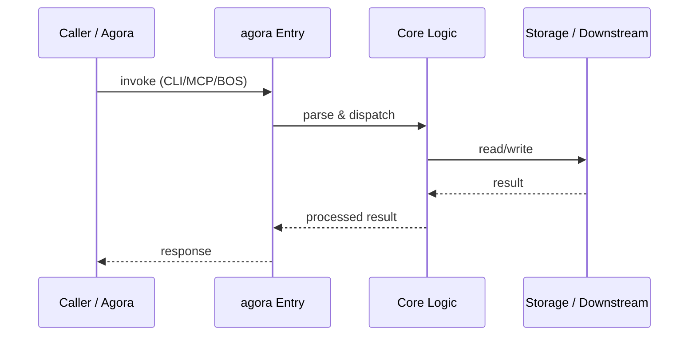

# agora — Call Chain

> 本文档描述 agora 内部最核心的一条调用链 / 数据流。
>
> 通用跨层调用链参见：[`../../docs/I0-AGORA-CALLCHAIN.md`](../../docs/I0-AGORA-CALLCHAIN.md)

---

## 关键路径

1. 1. MCP Client sends `resolve_bos_uri(uri)` to `server/tools_bos.py:255`
2. 2. Domain authorization (`_bos_domain_authorized`) enforces CR-RBAC-01 / CR-DOMAIN-AUTH-01
3. 3. Rate limiter (20 QPS/domain) and circuit breaker checks
4. 4. Cache lookup (`bos_cache.get`)
5. 5. `BOSRouter.resolve(uri)` performs O(k) Trie longest-prefix match (`mcp/bos_router.py:169`)
6. 6. Route adapter chosen: `poc` → `resolver/api.py`, `proxy` → ProxyManager, `internal` → importlib
7. 7. Transport execution: stdio / mcp_stdio / internal / http
8. 8. L0 audit hook (`mof_agora_hook.post_audit`) + event publish (`_publish_bos_event`)
9. 9. Cache write and response return

## Sequence Diagram

